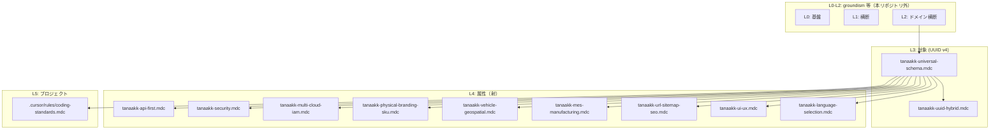

# 共通スキーマ 階層・抽象度チェック

共通ルールの抽象度レベルと重複を整理する。参照時は上位→下位の順で適用する。

## 0. Universal Guideline のスコープと階層（2026年2月改訂）

### 0.1 スコープの繰り下げ

**Universal Guideline は L3 以降の階層を定義する。** L0〜L2 は [groundism-ontopologics](https://github.com/tanaakk/groundism-ontopologics) 等で定義される。

### 0.2 射による階層の繰り下げ

UUID v4 を識別子規格として採用した場合、車両・製造・建設・貴金属・医療等の規格は、**UUID v4 で記録された対象への射として表現される属性**にすぎない。従ってこれらは UUID v4 と同列ではなく、その下位に位置づく。

### 0.3 階層定義

| 層 | 定義主体 | 内容 | 構造 |
|----|----------|------|------|
| **L0** | groundism 等（本リポジトリ外） | 基盤・場 | — |
| **L1** | 同上 | 横断的 concerns | — |
| **L2** | 同上 | ドメイン横断 | — |
| **L3** | **Universal Guideline** | **UUID v4**。識別子規格。対象（identity）の層 | 対象 |
| **L4** | **Universal Guideline** | 車両・製造・建設・貴金属・医療等の規格 | L3 対象への**射**としての属性 |
| **L5** | **Universal Guideline** | プロジェクト | L4 を前提とした実装 |

```
L3: 対象（UUID v4 で識別された点）
       ↓ 射
L4: 属性（VIN, SKU, ISIC, 品番等 — 対象への写像として表現）
       ↓
L5: プロジェクト
```

---

## 1. 階層構造（ルールファイル対応）



## 2. 抽象度レベル定義

| レベル | 適用範囲 | 内容 |
|-------|----------|------|
| **L0** | （groundism 外） | 基盤・場 |
| **L1** | （groundism 外） | 横断的 concerns |
| **L2** | （groundism 外） | ドメイン横断 |
| **L3** | Universal Guideline | **UUID v4** を識別子規格として採用。PK/FK、時間、単位、通貨、会計、クロスドメイン結合 |
| **L4** | Universal Guideline | 車両・製造・建設・貴金属・医療等の規格。**L3 対象への射としての属性**。VIN, SKU, ISIC, 品番等は属性として格納 |
| **L5** | Universal Guideline | プロジェクト固有のコーディング規約（Zustand、react-query-kit 等） |

## 3. 重複チェック

### 3.1 UUID v4 / PK / FK

| ファイル | 内容 | 判定 |
|----------|------|------|
| universal-schema | 2. ID設計: PK/FK は UUID v4、Surrogate Key 禁止 | **正**（L3 で定義） |
| universal-schema 2.1 | 規格対応表（VIN, SKU, 品番等は属性） | **正** |
| vehicle-geospatial | PK/FK は UUID v4、VIN 等は属性 | **重複**（L3 の具体化。参照で十分） |
| mes-manufacturing | PK は UUID v4、SKU/GTIN は属性 | **重複** |
| physical-branding-sku | Surrogate Key は UUID v4、結合は *_uuid | **重複** |
| api-first | PK/FK は UUID v4、業務コードは属性 | **重複** |

**推奨**: L4 では「tanaakk-universal-schema.mdc 2.1 を参照」とし、UUID ルールの再掲は最小限にする。

### 3.2 時刻・単位

| ファイル | 内容 | 判定 |
|----------|------|------|
| universal-schema | UTC + ISO 8601、単位 kg/m、Decimal 型 | **正**（L3） |
| vehicle-geospatial | 営業時間 UTC + ISO 8601、距離 m、decimal/numeric | **重複**（L3 の具体化） |

**推奨**: L4 では「時刻・単位は L3 に準拠」と参照のみ。

### 3.3 禁止事項

| ファイル | 内容 | 判定 |
|----------|------|------|
| universal-schema 7 | 複合キー、意味コード、曖昧時刻 | **正**（L3） |
| vehicle-geospatial 4 | VIN 等 PK 禁止、float 禁止、住所分離 | **正**（L4 固有の禁止。L3 を補足） |
| mes-manufacturing 4 | 製造番号・ロット番号 PK 禁止、SKU 結合禁止 | **正**（L4 固有） |
| physical-branding-sku 5 | カラー/SKU を PK 禁止 | **正**（L4 固有） |

**判定**: 禁止事項はレベルごとに適切に分離。重複なし。

### 3.4 型安全性・コーディング

| ファイル | 内容 | 判定 |
|----------|------|------|
| universal-schema 10 | TypeScript Interface 必須、any 禁止、単位明示 | **正**（L3 の実装規約） |
| coding-standards | Zustand、react-query-kit、i18n | **正**（L5 プロジェクト固有） |

**注意**: `any` 禁止は universal-schema と CLAUDE.md の両方に存在。universal はデータ設計、CLAUDE はプロジェクト全体。役割は異なるが、L5 の coding-standards に「any 禁止」が無い。universal-schema が横断ルールとして適用されるなら問題なし。

### 3.5 規格対応表（2.1）の重複

| 規格 | universal-schema 2.1 | ドメインルール |
|------|----------------------|----------------|
| ISO 3779 (VIN) | 属性。PK/FK 禁止 | vehicle-geospatial 1.2 で再掲 |
| GTIN, SKU, 品番 | 属性。PK/FK 禁止 | mes-manufacturing, physical-branding-sku で再掲 |
| ISO 12006-2, IFC | 属性。PK/FK 禁止 | vehicle-geospatial 3 で再掲 |
| ISA-95, B2MML | スキーマ参照。識別は UUID | mes-manufacturing 1 で再掲 |

**判定**: L3 で一覧、L4 でドメイン固有の詳細（規格の使い方、DTO 例）を記載。**役割分担は適切**。ただし L4 の「PK/FK 禁止」の繰り返しは削減可能。

### 3.6 ドメイン要約（2.4）とドメインルールの関係

| universal-schema 2.4 | 参照先 | 整合性 |
|---------------------|--------|--------|
| 移動体: timestamp + coordinates、FSM | vehicle-geospatial | **整合**。vehicle に FSM の明示的記述は薄いが、ステータス enum で対応 |
| 製造: SKU 構成、Decimal | mes-manufacturing, physical-branding-sku | **整合**。SKU 構成の詳細は physical-branding-sku にあり |
| 建設: IFC、asset_uuid | vehicle-geospatial | **要確認**。vehicle-geospatial に `asset_uuid` の明示的記述なし。universal-schema 2.3 で導入した概念 |

**推奨**: vehicle-geospatial の建設・設備に `asset_uuid` によるクロスドメイン参照の補足を追加するか、universal-schema 2.4 の建設の説明を「IFC 準拠、テレマティクスは設備 UUID で履歴」に調整。

### 3.7 ロケール・URL（L3 と url-sitemap-seo）

| 項目 | universal-schema 2.1 | url-sitemap-seo | 判定 |
|------|----------------------|-----------------|------|
| **ロケール** | BCP 47（ja-JP, en-US）、ISO 639-1 | パスでは `ja`、`en` 短縮形、先頭セグメント | **整合**。L3 が規格、L4 が URL での適用 |
| **日本語** | 規格表にロケール定義 | 日本語パス禁止（文字化け防止） | **補完**。L4 が L3 を前提に URL 固有の禁止を追加 |
| **参照** | - | 「tanaakk-universal-schema.mdc（ロケール BCP 47）と併用」 | **正**。L4 が L3 を正しく参照 |

**判定**: 重複なし。役割分担は適切。

## 4. 階層違反・要修正

### 4.1 universal-schema の抽象度混在

| セクション | 抽象度 | 判定 |
|------------|--------|------|
| 2.4 ドメイン別要約 | L4 の要約 | **適切**。L3 にドメイン要約があるのは、ナビゲーションとして有効 |
| 4. 会計API連携 | L3（横断） | **適切**。会計は全ドメインで共通 |
| 10. 実装・コーディング規約 | L3 だが TypeScript に依存 | **要検討**。TypeScript 非採用プロジェクトでは適用外。「TypeScript 採用時は」と条件付きにするとよい |

### 4.2 vehicle-geospatial の責務

- **車両** + **位置情報** + **建設・FM** の 3 ドメインを 1 ファイルに集約
- 建設・FM は製造と別ドメインだが、同じファイルに同居
- **判定**: 車両と位置・建設は「空間・資産」で関連が強いため、現状の統合は許容。ファイルが長くなったら分割を検討。

## 5. 推奨アクション

| 優先度 | アクション |
|--------|------------|
| **高** | なし。現状の階層と重複は許容範囲 |
| **中** | universal-schema 10 に「TypeScript 採用時は」と条件を追記 |
| **低** | L4 ルールの冒頭で「UUID/時刻/単位は tanaakk-universal-schema.mdc に準拠」と明記し、重複記述を削減 |
| **低** | vehicle-geospatial の建設セクションに `asset_uuid` によるクロスドメイン参照の補足を追加 |

## 6. 参照マトリクス

|  | universal | api-first | security | url-sitemap-seo | ui-ux | language-selection | vehicle | mes | physical-branding |
|---|-----------|-----------|----------|-----------------|-------|-------------------|---------|-----|-------------------|
| **universal** | - | - | - | - | - | - | - | - | - |
| **api-first** | ✓ 併用 | - | - | - | - | - | - | - | - |
| **security** | ✓ 併用 | - | - | - | - | - | - | - | - |
| **url-sitemap-seo** | ✓ 併用 | - | - | - | - | - | - | - | - |
| **ui-ux** | - | - | - | - | - | - | - | - | - |
| **language-selection** | - | - | - | - | - | - | - | - | - |
| **vehicle** | ✓ ベース | - | - | - | - | - | - | - | - |
| **mes** | ✓ ベース | - | - | - | - | - | - | - | - |
| **physical-branding** | ✓ 併用 | - | - | - | - | - | - | - | - |

**原則**: L3 は他を参照しない。L4/L5 は L3 を必ず参照する（ui-ux、language-selection は L3 に依存しない横断ルール）。
